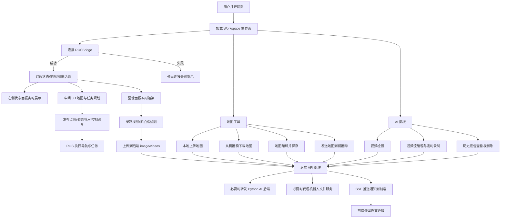

# visual-app 项目功能总览

## 1. 项目定位
- 面向机器狗场景的 Web 控制与可视化平台。
- 目标能力：ROS 连接、地图与任务规划、视频/图像采集、远程文件传输、AI 视频检测、定时任务编排、运行监控与通知。

## 2. 整体架构
- 前端：Vue 3 + TypeScript + Element Plus + Pinia + Three.js。
- 后端：Node.js + Express，负责静态资源、文件处理、SSE、地图/视频管理、机器人文件服务代理、天气与定时任务。
- 外部系统：
  - ROSBridge（WebSocket）
  - 机器人文件服务（/api/files，通常 808x 端口）
  - Python AI 后端（统一由 Node /api 代理）
  - Open-Meteo（天气）
  - RocketMQ（可选，按配置启用）

## 3. 前端功能

### 3.1 工作台布局（当前主入口）
- 三栏布局：
  - 左侧：机器人状态、地图工具
  - 中间：3D 任务规划 + 悬浮摄像头面板（可放大互换）
  - 右侧：设置面板 + AI 功能入口
- 连接异常弹窗与断连告警。

### 3.2 机器人连接与 ROS 基础能力
- 建立/断开 ROS WebSocket 连接。
- 自动维护连接状态、断连回调、心跳检测（支持页面隐藏时暂停）。
- 通用 ROS 能力：话题列表获取、订阅、取消订阅、发布消息、服务调用。

### 3.3 机器人状态面板
- 实时展示：系统状态、主板温度、位置速度、电池、足端力、电机热状态。
- 高温保护：温度阈值触发时自动发布保护控制话题。
- 内置“定时任务管理”：新增/编辑/删除任务（关联机器人 IP、执行时间、星期循环、启停状态）。

### 3.4 3D 任务规划面板
- Three.js 地图可视化（OccupancyGrid 转纹理渲染）。
- 显示全局路径、足迹、队列标记点、文本标记等。
- 相机视角控制与自适应地图。
- 发布式交互：点击发布点位/姿态/位姿估计到 ROS 话题。

### 3.5 图像面板
- 摄像头话题自动发现与订阅（压缩/非压缩图像兼容）。
- Canvas 实时渲染与性能节流（消息丢帧策略）。
- 任务联动自动采集：根据任务状态进行 PTZ 控制、自动上传巡检图片、任务结束恢复流程。
- 支持面板全屏切换。

### 3.6 图像设置与视频管理
- 摄像头选择。
- 录制控制（开始/停止、分段设置）。
- 云台控制（上下左右、持续旋转、缩放、居中、停止）。
- 视频管理：查看日期分组视频、下载、重命名、删除。

### 3.7 地图工具面板
- 建图控制：开始/停止建图，订阅建图状态。
- 地图列表管理：刷新、选择当前地图、查看路线数量。
- 地图上传：
  - 从本地文件夹上传（结构校验、进度显示）
  - 从机器狗下载地图并入库（SSE 进度）
- 地图下发：将地图文件发送到机器狗（SSE 进度、大小/速度统计）。
- 地图编辑器：
  - 画笔/矩形/橡皮/标签
  - 缩放、撤销、清空、反色
  - 保存为新图或覆盖保存

### 3.8 三维设置面板（运行控制）
- 导航系统启停、任务开始/停止/清空。
- 路线文件管理：保存/加载/删除队列。
- 循环模式：单次、无限、指定次数。
- 手动底盘控制（速度控制与连续发布）。
- 机器狗动作与模式切换（起立/趴下、灵动/经典）。
- 天气检查与默认城市设置（用于任务启动前辅助判断）。
- 定时任务创建入口（服务端持久化执行）。

### 3.9 AI 面板
- 视频检测：按日期选择服务器视频并批量检测，展示异常结果与报告链接。
- 视频流管理：RTSP 流增删、定时录制计划管理。
- 历史报告：按日期分组查看与删除报告。

### 3.10 通知系统
- 全局 SSE 订阅 /api/events。
- 支持图文通知弹窗（含图片 URL 渲染）。

### 3.11 文件管理（可用模块）
- 基于机器人文件服务代理实现同源文件浏览与操作：
  - 目录浏览、路径导航
  - 上传、下载、删除、复制、移动、新建目录
- 通过 /api/robot-files 代理访问机器人 /api/files，规避浏览器直连跨域问题。

### 3.12 兼容/保留模块
- 旧版主布局 MainLayout 及其组件（ConnectionStatus、TopicSelector、ImageViewer、StateInfo、TopicPublisher）仍保留在代码中，当前路由默认入口为 Workspace。
- VoicePanelBackup 为备份语音面板实现。

## 4. 后端功能（Node/Express）

### 4.1 静态资源与基础能力
- 托管前端 dist（/robot-dog-web）。
- 托管地图目录（/maps）与图片目录（/images）。
- 支持 PGM 文件 gzip 压缩传输。
- 大文件 multipart 流式处理（含大小限制与临时文件机制）。

### 4.2 地图 API
- 上传单文件、上传文件夹、保存地图、另存新地图。
- 地图列表查询、子目录文件查询、配置更新、删除地图。
- 从机器狗下载地图到服务器（SSE 实时进度、断点续传逻辑）。
- 发送地图到机器狗（SSE 实时进度）。

### 4.3 图像与视频 API
- 图片上传（含 check 目录保留最近 100 张）。
- 视频上传、列表、下载、重命名、删除。
- 从机器狗下载任意远程文件夹到 image 目录。

### 4.4 天气与配置 API
- 查询天气（带缓存与失败回退）。
- 查询/更新默认城市配置。

### 4.5 定时任务 API
- /api/schedules 的增删改查。
- ScheduleManager 定时扫描并执行：连接机器人、控制起立/导航/任务启动、监听结束并收尾。

### 4.6 通知与事件 API
- /api/events：SSE 长连接推送。
- /api/notification：将通知广播给所有在线前端。

### 4.7 机器人文件服务代理
- /api/robot-files：统一代理机器人 /api/files。
- 支持 ws/wss 到 808x 端口映射，剥离 hop-by-hop 头，避免代理异常。

### 4.8 RocketMQ（可选）
- /api/mq/publish：发布消息。
- /api/mq/stream：SSE 消费流。
- 若未安装 RocketMQ 客户端或未配置主题，自动降级为禁用状态。

### 4.9 外部后端代理
- 其他 /api/* 请求转发到 Python 后端服务（TARGET_API）。

## 5. 数据与配置
- 数据目录：maps、image、videos、temp。
- 关键配置：
  - config/weather.json（默认城市）
  - config/schedules.json（定时任务持久化）
  - config/rocketmq.config.json（可选，示例文件已提供）

## 6. 部署与运维能力
- Docker 镜像部署（Node 后端 + Nginx）。
- docker-compose 一键部署与数据卷持久化。
- 发布脚本：镜像构建、推送阿里云镜像仓库。
- 本地重建脚本：前端构建 + 后端容器重启。

## 7. 功能覆盖结论
- 当前项目已覆盖：机器人连接控制、实时状态监测、地图全生命周期管理（建图/编辑/上传/下发）、图像视频采集管理、AI 识别与报告、服务端定时任务、SSE 通知、机器人文件代理与可选 MQ 消息链路。

## 8. 工作流程图（端到端）

## 9. 整个网页操作流程（推荐顺序）

1. 进入页面后，先在连接入口连接机器狗 ROS 地址，确认状态变为“已连接”。
2. 查看左侧“状态”面板，确认电量、温度、系统状态正常；若电量过低先不要启动任务。
3. 在“地图工具”中选择当前地图，或执行“上传地图/从机器狗上传/地图编辑保存”。
4. 在“地图设置”中执行“加载地图（导航启动）”，确认导航系统运行中。
5. 在中间 3D 面板观察地图、路径、标记点；根据需要点击发布点位/姿态进行任务规划。
6. 在“路线管理”里保存或加载队列；在“路线控制”中开始、暂停/停止、清空任务，并设置循环模式。
7. 在图像区域与“图像设置”中选择摄像头、控制云台、开始/停止录制，并在视频管理中回看下载。
8. 需要自动化时，在“定时任务”中配置执行时间与重复周期，交由服务端后台执行。
9. 需要智能分析时，进入“AI 功能”：选择视频批量检测，查看异常报告，管理视频流和录制计划。
10. 全程关注右下角/全局通知（SSE），处理告警、任务完成、异常信息；任务结束后断开连接。

## 10. 常见业务闭环示例

### 10.1 巡检任务闭环
- 连接机器人 -> 选择地图 -> 启动导航 -> 下发路线 -> 开始任务 -> 自动采集图像/录像 -> AI 检测 -> 查看报告 -> 归档。

### 10.2 地图更新闭环
- 停止当前任务 -> 建图或下载新地图 -> 地图编辑修订 -> 保存新版本 -> 下发到机器人 -> 加载验证 -> 切换生产使用。

### 10.3 故障处理闭环
- 收到告警通知 -> 查看状态面板（电量/温度/电机）-> 必要时暂停任务与手动接管 -> 修复后恢复任务或重新调度。