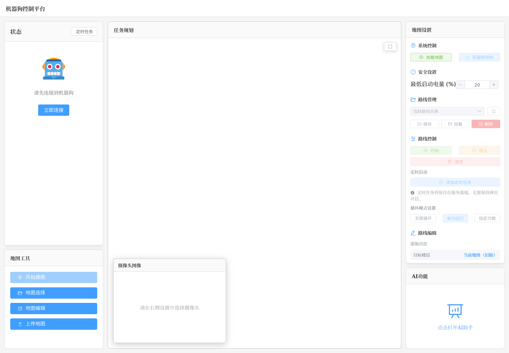

# 机器狗控制平台网页使用手册

> 版本日期：2026-06-12  
> 适用对象：现场操作人员、巡检任务配置人员、地图维护人员  
> 截图说明：`docs/images/main-workspace.png` 已使用当前网页实际截图；其他截图文件已先用当前页面截图占位，连接机器狗并打开对应弹窗后可逐张替换为更准确的界面截图。

## 1. 界面总览

网页主界面分为五个区域：

| 区域 | 名称 | 主要用途 |
| --- | --- | --- |
| 左上 | 状态 | 连接机器狗、查看电量/温度/运动状态、管理定时任务 |
| 左下 | 地图工具 | 建图、地图选择、地图编辑、上传地图 |
| 中间 | 任务规划 | 显示地图、机器人位置、路径、任务点，支持点击添加位姿/目标点 |
| 中下浮窗 | 摄像头图像 | 查看摄像头实时画面，支持放大显示 |
| 右侧 | 设置 / AI功能 | 根据当前选中的面板显示地图设置或图像设置，底部打开 AI 助手 |

点击中间的“任务规划”区域，右侧显示“地图设置”。点击“摄像头图像”区域，右侧切换为“图像设置”。

## 2. 首次连接机器狗

1. 在左上“状态”面板中点击 **立即连接**。
2. 在“连接到机器狗”弹窗中选择已保存连接，或点击 **新增连接**。
3. 新增连接时填写：
   - 连接地址：例如 `ws://192.168.1.100:9090`
   - 连接名称：例如 `机器狗1号`
4. 点击 **连接**。
5. 连接成功后，状态面板显示“已连接”，并开始显示电池、运动、电机等状态。

常用按钮：

| 按钮 | 作用 |
| --- | --- |
| 立即连接 | 打开 ROS Bridge 连接弹窗 |
| 新增连接 | 新增一个 WebSocket 连接地址 |
| 编辑 | 修改已保存连接的名称 |
| 删除 | 删除已保存连接 |
| 切换 | 断开当前连接并重新选择机器狗 |

## 3. 推荐巡检流程

一次常规巡检建议按以下顺序操作：

1. **连接机器狗**  
   确认左上角状态显示“已连接”，电量满足现场要求。

2. **选择地图**  
   在“地图工具”中点击 **地图选择**，选择需要使用的地图，点击 **确定**。系统会将地图文件发送到机器狗。

3. **加载导航地图**  
   点击右侧“地图设置”中的 **加载地图**。页面会先显示天气弹窗，确认天气后点击 **确认并加载地图**。

4. **确认地图显示**  
   中间“任务规划”区域应显示地图、机器人轮廓、路径和任务点。  
   多楼层模式下，左上方会出现地图标签：**当前 / 一楼 / 二楼**。

5. **设置初始位姿**  
   点击 **初始位姿**，在地图上点击第一个点作为位置，再点击第二个点确定朝向，确认后发布初始位姿。

6. **添加目标点位**  
   点击 **目标点位**，在地图上点击位置和朝向，确认后添加到任务队列。

7. **保存路线**  
   在“路线管理”中选择或输入路线名称，点击 **保存**。

8. **启动路线**  
   在“路线控制”中点击 **开始**，机器狗按任务队列执行巡检。

9. **任务结束或异常处理**  
   可点击 **停止** 停止队列，点击 **清空** 清除当前队列；需要人工接管时点击 **机器狗控制**。

## 4. 多楼层地图与目标点规则

多楼层模式只有在前端同时接收到 `/map1` 和 `/map2` 地图数据后启用。只接收到 `/map` 时，页面保持旧版模式。

地图标签含义：

| 标签 | 含义 | 是否可发布目标点 |
| --- | --- | --- |
| 当前 | `/map`，move_base 当前实际使用的活动地图 | 多楼层模式下不可发布目标点 |
| 一楼 | `/map1`，一楼地图 | 可发布到 `/goal_queue/add_pose1` |
| 二楼 | `/map2`，二楼地图 | 可发布到 `/goal_queue/add_pose2` |

重要规则：

- 旧版模式下，目标点继续发布到 `/goal_queue/add_pose`。
- 多楼层模式下，目标点只能从“一楼”或“二楼”标签发布。
- 多楼层模式下，“当前”标签只用于查看当前导航地图，不用于添加目标点。
- 不要向 `/map`、`/map1`、`/map2` 发布目标点，这三个是地图话题。

### 多楼层任务点显示

任务点标签由后端 Marker 直接提供，前端不会重新编号。

| 视图 | 显示内容 | 标签示例 |
| --- | --- | --- |
| 当前 | 根据当前楼层显示对应楼层任务点 | 当前楼层为一楼时显示 `1-1`、`1-3` |
| 一楼 | 只显示一楼任务点 | `1-1`、`1-3`、`1-5` |
| 二楼 | 只显示二楼任务点 | `2-2`、`2-4` |
| 旧版 | 显示旧版全局任务点 | `1`、`2`、`3` |

删除、修改、插入任务点时，仍按全局原始队列编号处理。例如：

| 地图标签 | 含义 | 删除接口索引 |
| --- | --- | --- |
| `1-3` | 一楼显示的原始队列第 3 个点 | `2` |
| `2-4` | 二楼显示的原始队列第 4 个点 | `3` |

## 5. 任务规划地图操作

地图区域可进行以下操作：

| 操作 | 说明 |
| --- | --- |
| 鼠标滚轮 | 缩放地图 |
| 鼠标拖拽 | 平移地图 |
| 适应地图按钮 | 将地图自动缩放到合适视野 |
| 当前 / 一楼 / 二楼 | 多楼层模式下切换地图视图 |
| 点击地图两次 | 在添加初始位姿或目标点时，第一次确定位置，第二次确定朝向 |

地图上常见元素：

| 元素 | 含义 |
| --- | --- |
| 栅格地图 | 当前或指定楼层的 OccupancyGrid 地图 |
| 机器人轮廓 | 当前机器人位置和朝向 |
| 路径线 | 导航规划路径 |
| 任务点箭头 | 队列中的目标点和朝向 |
| 任务点文字 | 队列编号或楼层编号，例如 `1`、`1-3`、`2-4` |

## 6. 地图设置面板

### 6.1 系统控制

| 按钮 / 字段 | 作用 |
| --- | --- |
| 加载地图 | 启动导航程序并加载地图，启动前会显示天气信息 |
| 停止 | 停止导航程序 |
| 机器狗控制 | 打开手动控制弹窗；打开时会暂停任务队列，关闭后继续 |
| 当前楼层 | 多楼层模式下显示当前导航楼层，例如“一楼”或“二楼” |

### 6.2 安全设置

| 字段 | 作用 |
| --- | --- |
| 最低启动电量 (%) | 设置允许启动路线的最低电量；电量不足时会阻止启动 |

### 6.3 路线管理

| 控件 | 作用 |
| --- | --- |
| 路线名称下拉框 | 选择已保存路线 |
| 刷新按钮 | 重新读取路线列表 |
| 保存 | 将当前任务队列保存为选中的路线名称 |
| 加载 | 加载选中的路线到当前任务队列 |
| 删除 | 删除选中的路线 |

路线列表会显示每条路线的一楼点数和二楼点数，便于确认多楼层任务分布。

### 6.4 路线控制

| 按钮 / 模式 | 作用 |
| --- | --- |
| 开始 | 启动当前任务队列 |
| 停止 | 停止当前任务队列 |
| 清空 | 清空当前任务队列 |
| 添加定时任务 | 设置每周固定时间启动巡检 |
| 无限循环 | 队列执行完后持续循环 |
| 单次运行 | 队列执行一次后停止 |
| 指定次数 | 输入循环次数后按次数执行 |

状态区会显示当前队列点数、楼层点数、当前执行点和循环状态。

### 6.5 路线编辑

| 按钮 | 作用 | 操作方式 |
| --- | --- | --- |
| 初始位姿 | 发布机器人初始位姿 | 点击地图两次，第一次位置，第二次朝向 |
| 目标点位 | 添加任务目标点 | 点击地图两次，第一次目标位置，第二次目标朝向 |
| 修改 | 修改指定任务点 | 输入任务点编号，再在地图上选择新位置和朝向 |
| 插入 | 在指定位置插入任务点 | 输入插入位置，再在地图上选择新目标点 |
| 录制 | 设置某个点位是否录制视频 | 输入点位编号，选择“录制”或“不录制” |
| 删除 | 删除指定任务点 | 输入全局任务编号，或多楼层标签如 `1-3`、`2-4` |

多楼层模式下，目标楼层显示为当前地图标签。只有选择“一楼”或“二楼”时才能添加目标点。

## 7. 机器狗手动控制

打开方式：右侧“地图设置”中点击 **机器狗控制**。

| 按钮 | 作用 |
| --- | --- |
| ↑ | 前进，按住持续移动 |
| ↓ | 后退，按住持续移动 |
| ← | 左移，按住持续移动 |
| → | 右移，按住持续移动 |
| 左转 | 原地左转，按住持续转动 |
| 右转 | 原地右转，按住持续转动 |
| 停止 | 立即停止运动 |
| 灵动模式 | 切换到灵动模式 |
| 经典模式 | 切换到经典模式 |
| 遥控器控制 | 切到遥控器控制并保持数据转发 |
| SDK控制 | 恢复 Jetson SDK 控制并保持数据转发 |
| 起立 | 机器狗起立 |
| 趴下 | 机器狗趴下 |

注意：手动控制会暂停当前任务队列。关闭控制弹窗后，系统会尝试继续队列任务。

## 8. 天气确认

点击 **加载地图** 时会弹出“当前天气”窗口。窗口显示：

- 当前温度
- 天气描述
- 湿度
- 风速
- 城市
- 当前是否降雨
- 未来几小时降雨概率

| 控件 | 作用 |
| --- | --- |
| 城市输入框 | 输入城市拼音，例如 `Beijing` |
| 刷新按钮 | 重新获取天气 |
| 设为默认 | 将当前城市保存为默认城市 |
| 确认并加载地图 | 关闭弹窗并启动导航加载地图 |

## 9. 地图工具

### 9.1 主按钮

| 按钮 | 作用 |
| --- | --- |
| 开始建图 | 启动建图流程 |
| 地图选择 | 选择已有地图并发送到机器狗 |
| 地图编辑 | 打开地图编辑器 |
| 上传地图 | 从本地或机器狗导入地图到网页服务器 |

### 9.2 地图选择

在“选择地图”弹窗中：

1. 点击刷新按钮获取最新地图列表。
2. 选择地图文件夹。
3. 查看地图创建时间和路线数量。
4. 点击 **确定** 发送地图文件。

### 9.3 上传地图

上传方式：

| 方式 | 说明 |
| --- | --- |
| 从本地上传地图文件夹 | 选择本地地图文件夹，填写地图名称和描述后上传 |
| 从机器狗上传 | 从已连接机器狗拉取地图文件 |

上传时会显示文件数量、总大小、进度和预计剩余时间。

### 9.4 地图编辑

地图编辑器工具：

| 工具 / 按钮 | 作用 |
| --- | --- |
| 画笔 | 在地图上绘制区域 |
| 框选 | 框选矩形区域 |
| 橡皮擦 | 擦除地图内容 |
| 标签 | 在地图上添加标签 |
| 管理标签 | 查看和删除地图标签 |
| 画笔大小 | 调整画笔或橡皮擦大小 |
| 缩小 / 放大 | 调整编辑视图缩放 |
| 重置缩放 | 将缩放恢复到默认 |
| 清空地图 | 清除地图内容 |
| 反转颜色 | 反转地图颜色 |
| 撤销 | 撤销上一步编辑 |
| 保存地图 | 覆盖原地图或另存为新地图 |

保存地图时可选择：

- 覆盖原图
- 保存为新文件，并填写地图名称和描述

### 9.5 建图

点击 **开始建图** 后会显示确认弹窗。开始前请确认：

- 已备份或上传现有地图
- 当前导航任务已停止
- 建图范围不要过大
- 机器狗运动稳定

建图运行中点击 **停止建图**，系统会自动保存建图文件。

## 10. 状态面板

连接成功后，状态面板显示：

| 信息 | 说明 |
| --- | --- |
| 系统状态 | 正常、错误、电机错误数量等 |
| 主板温度 | 主板当前温度 |
| 运动状态 | 位置和速度 |
| 电池状态 | 电量百分比、电池模式、电池温度 |
| 电机状态 | 最热/最冷电机和温度 |
| 足端力 | 四足足端力 |
| 更新时间 | 最近一次状态数据更新时间 |

状态面板中的 **定时任务** 用于设置网页级定时连接/启动任务：

| 按钮 | 作用 |
| --- | --- |
| 添加任务 | 新增定时任务 |
| 编辑 | 修改任务名称、机器狗、重复日期、启动时间 |
| 删除 | 删除定时任务 |
| 启用状态 | 控制定时任务是否生效 |

## 11. 摄像头图像与图像设置

### 11.1 摄像头图像窗口

| 状态 / 按钮 | 说明 |
| --- | --- |
| 正在获取话题列表 | 正在读取 ROS 图像话题 |
| 重试 | 获取话题失败时重新尝试 |
| 等待图像数据 | 已选择摄像头，但暂未收到图像 |
| 放大显示 | 将摄像头窗口放大 |
| 恢复大小 | 将摄像头窗口恢复为浮窗 |

### 11.2 摄像头选择

在右侧“图像设置”中选择摄像头。下拉框会列出 ROS 中的 `Image` 或 `CompressedImage` 话题，并显示为“摄像头1”“摄像头2”等。

### 11.3 录制控制

| 按钮 / 设置 | 作用 |
| --- | --- |
| 开始录制 | 打开录制设置弹窗 |
| 持续录制 | 从开始到手动停止保存为一个录制 |
| 分段录制 | 按指定分钟数分段保存 |
| 停止录制 | 停止当前录制 |
| 视频管理 | 查看、重命名、下载、删除本地录制视频 |

视频管理中按日期分组显示视频，展开日期后可对单个视频执行：

- 重命名
- 下载
- 删除

### 11.4 云台控制

| 按钮 | 作用 |
| --- | --- |
| 上转 / 下转 | 控制云台俯仰 |
| 左转 / 右转 | 按住持续水平转动 |
| 居中 | 云台回中 |
| 放大 / 缩小 | 控制摄像头缩放 |
| 持续左转 / 持续右转 | 按住持续旋转 |
| 停止 | 停止云台动作 |

## 12. AI 助手

点击右下“AI功能”区域打开 AI 助手。AI 助手包含四个标签页：视频检测、视频流管理、历史报告、语音控制。

### 12.1 视频检测

| 控件 | 作用 |
| --- | --- |
| 选择日期 | 选择服务器视频日期 |
| 刷新列表 | 重新获取视频列表 |
| 视频复选框 | 选择需要检测的视频 |
| 检测选中视频 | 对选中日期的视频文件夹发起 AI 检测 |
| 查看报告 | 打开检测生成的报告 |

检测结果会显示：

- 文件名
- 正常 / 异常
- 异常类型
- 异常描述
- 严重程度
- 建议处理

### 12.2 视频流管理

| 控件 | 作用 |
| --- | --- |
| 添加视频流 | 添加 RTSP 视频流 |
| 刷新列表 | 重新获取视频流列表 |
| 定时录制 | 为指定视频流设置录制计划 |
| 删除 | 删除视频流 |

添加视频流需要填写：

- RTSP 地址
- 名称
- 位置
- 描述

定时录制可设置开始时间、录制时长、重复周期和启用状态。

### 12.3 历史报告

| 控件 | 作用 |
| --- | --- |
| 刷新列表 | 重新读取历史报告 |
| 查看 | 打开报告 |
| 删除 | 删除指定报告 |

报告按日期折叠分组显示。

### 12.4 语音控制

| 控件 | 作用 |
| --- | --- |
| 播报文本 | 输入需要机器人播报的内容 |
| 音色 | 选择男声或女声 |
| 循环播放 | 是否循环播报 |
| 播放文本 | 发送语音合成命令 |
| 停止循环 | 停止循环播报 |
| 开灯 / 关灯 | 控制灯光开关 |
| 灯光模式 | 切换灯光模式 |
| 响应状态 | 查看 TTS 和设备控制响应 |
| 操作日志 | 查看语音控制操作记录 |

语音控制需要 ROS 已连接，且响应通道就绪。

## 13. 常见问题处理

### 13.1 页面提示未连接

处理方式：

1. 检查机器狗和网页所在网络是否连通。
2. 检查 ROS Bridge 是否运行。
3. 确认连接地址格式为 `ws://IP:9090` 或 `wss://域名/路径`。
4. 重新点击 **立即连接**。

### 13.2 加载地图按钮不可用或导航未启动

处理方式：

1. 先连接机器狗。
2. 确认已选择地图。
3. 查看天气弹窗是否已点击 **确认并加载地图**。
4. 检查 `/launch_trigger_status` 是否为 `running`。

### 13.3 多楼层标签不显示

多楼层标签只在同时收到 `/map1` 和 `/map2` 后显示。若没有显示：

1. 确认 ROS 中存在 `/map1` 和 `/map2`。
2. 确认两个话题都有实际 `nav_msgs/OccupancyGrid` 数据发布。
3. 刷新页面或重新加载导航程序。
4. 如果只有 `/map`，页面会自动保持旧版模式。

### 13.4 多楼层模式下无法在“当前”添加目标点

这是正常限制。多楼层模式下：

- “当前”只用于查看 `/map` 当前活动地图。
- 添加目标点请切换到“一楼”或“二楼”。

### 13.5 任务点编号看起来不连续

这是多楼层过滤显示的正常现象。例如原始队列为：

| 全局编号 | 楼层 |
| --- | --- |
| 1 | 一楼 |
| 2 | 二楼 |
| 3 | 一楼 |
| 4 | 二楼 |

一楼视图显示 `1-1`、`1-3`，二楼视图显示 `2-2`、`2-4`。编号保留全局队列顺序，不按楼层重新编号。

### 13.6 摄像头没有画面

处理方式：

1. 确认已连接 ROS。
2. 在右侧“图像设置”中选择摄像头。
3. 确认对应 ROS 图像话题正在发布数据。
4. 点击“重试”重新获取话题列表。

### 13.7 天气获取失败

处理方式：

1. 检查网页服务器网络是否可访问外网。
2. 在天气弹窗中换一个城市拼音，例如 `Beijing`。
3. 点击刷新按钮重试。
4. 如果天气服务短时不可用，可稍后重试。

### 13.8 AI 视频检测失败

处理方式：

1. 确认 AI 后端服务可访问。
2. 点击 **刷新列表**，确认能读取视频文件。
3. 确认选中的视频文件存在且格式正常。
4. 若报告无法打开，检查后端报告服务路径。

## 14. 安全注意事项

- 启动巡检前确认现场路线无障碍物。
- 电量低于设置阈值时不要强行启动任务。
- 建图、地图编辑、路线任务不要同时进行。
- 多任务队列运行中不要手动发送抢占目标，除非明确需要中断当前任务。
- 手动控制机器狗前，应确认周围人员和设备安全。
- 建图会影响现有地图文件，操作前请确认地图已备份。

## 15. 截图清单

建议补充以下截图，便于现场培训：

| 文件名 | 截图内容 |
| --- | --- |
| `docs/images/main-workspace.png` | 主界面总览 |
| `docs/images/connect-dialog.png` | 连接机器狗弹窗 |
| `docs/images/navigation-flow.png` | 一次巡检任务示例 |
| `docs/images/multi-floor-tabs.png` | 多楼层地图标签 |
| `docs/images/three-d-panel.png` | 任务规划地图 |
| `docs/images/three-d-settings.png` | 地图设置面板 |
| `docs/images/route-management.png` | 路线管理 |
| `docs/images/route-editing.png` | 路线编辑 |
| `docs/images/robot-control.png` | 机器狗控制弹窗 |
| `docs/images/weather-dialog.png` | 天气弹窗 |
| `docs/images/map-tools.png` | 地图工具 |
| `docs/images/map-editor.png` | 地图编辑器 |
| `docs/images/status-panel.png` | 状态面板 |
| `docs/images/image-panel.png` | 摄像头图像 |
| `docs/images/ptz-control.png` | 云台控制 |
| `docs/images/ai-panel.png` | AI 助手 |
| `docs/images/voice-control.png` | 语音控制 |

## 16. 附录：关键 ROS 话题

| 功能 | 话题 |
| --- | --- |
| 旧版地图 | `/map` |
| 一楼地图 | `/map1` |
| 二楼地图 | `/map2` |
| 当前楼层 | `/map_manager/current_map` |
| 地图管理状态 | `/map_manager/status` |
| 添加旧版目标点 | `/goal_queue/add_pose` |
| 添加一楼目标点 | `/goal_queue/add_pose1` |
| 添加二楼目标点 | `/goal_queue/add_pose2` |
| 队列列表 | `/goal_queue/list` |
| 启动队列 | `/goal_queue/start` |
| 停止队列 | `/goal_queue/stop` |
| 暂停队列 | `/goal_queue/pause` |
| 继续队列 | `/goal_queue/continue` |
| 清空队列 | `/goal_queue/clear` |
| 删除点位 | `/goal_queue/delete_point` |
| 修改点位 | `/goal_queue/modify_point` |
| 插入点位 | `/goal_queue/insert_point` |
| 旧版任务点 Marker | `/goal_queue/markers` |
| 一楼任务点 Marker | `/goal_queue/markers1` |
| 二楼任务点 Marker | `/goal_queue/markers2` |
| 导航程序状态 | `/launch_trigger_status` |
